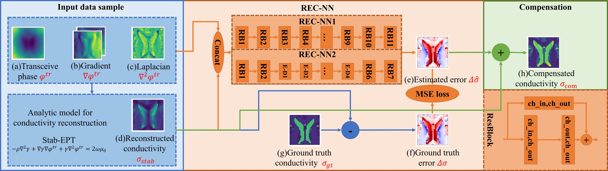
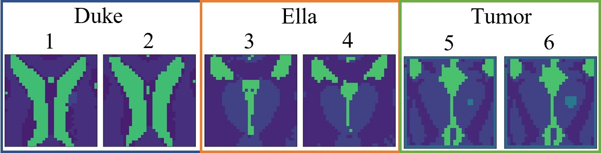
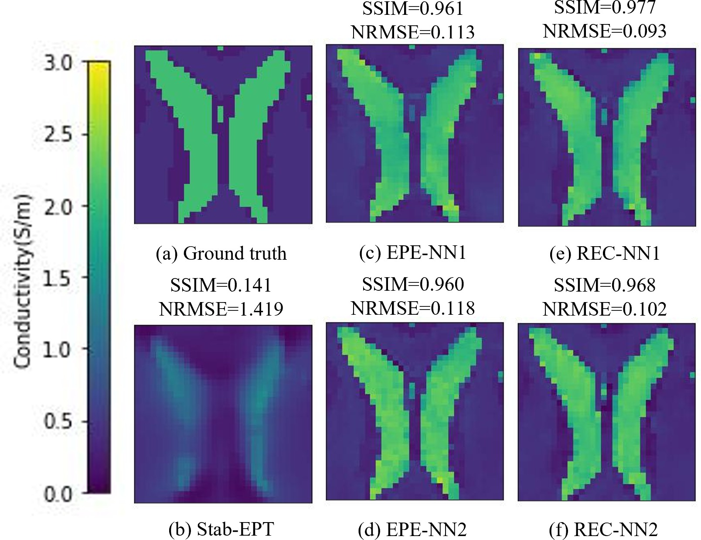
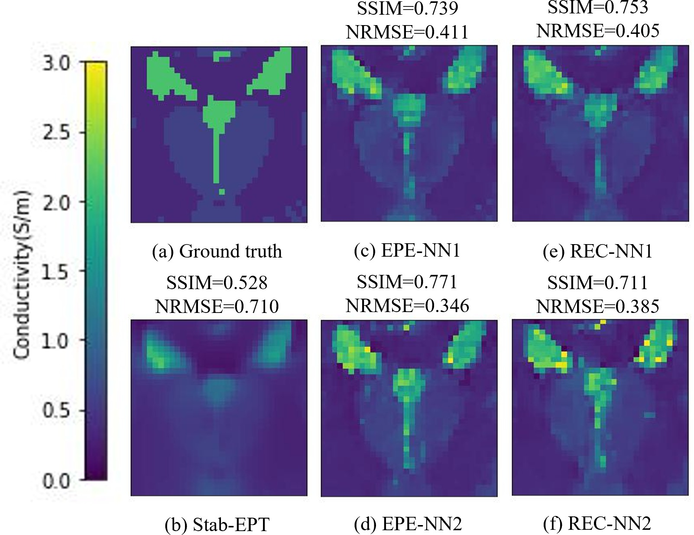
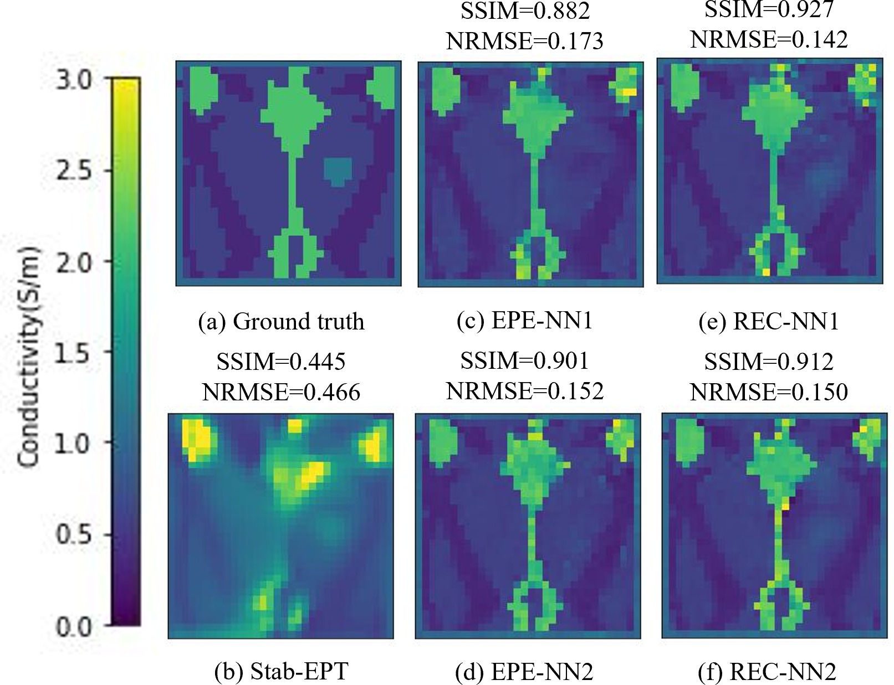
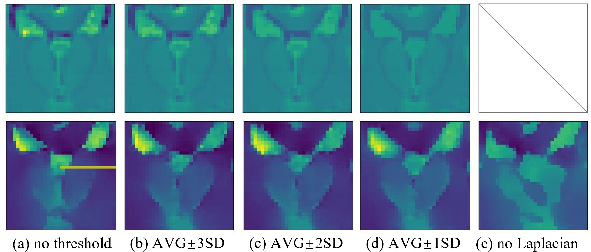
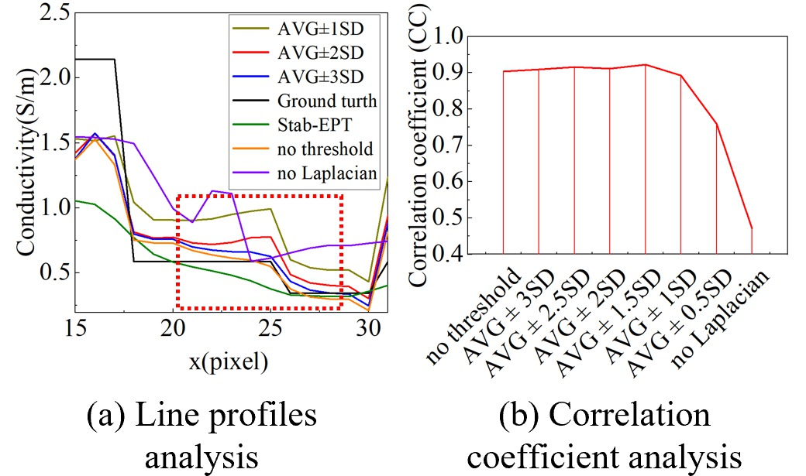

# REC-NN

PyTorch implementation of the Reconstruction Error Compensation Neural Network
(REC-NN) for conductivity reconstruction in Magnetic Resonance Electrical
Property Tomography (MREPT).

This repository is organized around two conference papers:

1. [REC-NN: A Reconstruction Error Compensation Neural Network for Magnetic Resonance Electrical Property Tomography (MREPT)](https://ieeexplore.ieee.org/document/10340423)
2. [Is Laplacian Indispensable to Magnetic Resonance Electrical Property Tomography (MREPT)? An Analysis from the Perspective of Reconstruction Error Compensation Neural Networks](https://ieeexplore.ieee.org/document/10265641)

## Background

MREPT estimates tissue electrical properties from MRI measurements. Analytical
reconstruction methods are physically interpretable, but numerical
differentiation is sensitive to noise and model assumptions can produce
artifacts or reduce tissue contrast.

The papers propose REC-NN as a hybrid strategy: Stab-EPT first provides a
physics-based conductivity reconstruction, and a neural network then predicts
the remaining reconstruction error. This differs from an end-to-end electrical
property estimation network (EPE-NN), which directly predicts conductivity.

## Method

Let `sigma_stab` be the conductivity reconstructed by Stab-EPT and `sigma_gt`
the ground-truth conductivity. The true reconstruction error is

```text
Delta_sigma = sigma_gt - sigma_stab
```

REC-NN estimates this error and compensates the Stab-EPT result:

```text
Delta_sigma_hat = NN(phi, grad_x(phi), grad_y(phi), laplacian(phi), sigma_stab)
sigma_rec = sigma_stab + Delta_sigma_hat
```

The supervised objective described in the papers is

```text
L_REC = MSE(Delta_sigma_hat, Delta_sigma)
```

The EPE-NN baseline uses the phase and derivative features without
`sigma_stab`, and directly estimates `sigma_gt`.



*REC-NN framework used for reconstruction error compensation in the EMBC 2023 study.*

### Input features

- Transceive phase
- First-order phase derivatives in the x and y directions
- Phase Laplacian
- Stab-EPT conductivity for REC-NN only

### Network variants

- **REC-NN1 (`recnn1`)** uses only ResNet blocks and does not contain an
  encoder-decoder structure.
- **REC-NN2 (`recnn2`)** combines ResNet blocks with an encoder-decoder
  structure that performs spatial downsampling and upsampling.

The EPE baselines follow the same distinction: **EPE-NN1** uses the REC-NN1
network structure without an encoder-decoder, while **EPE-NN2** uses the
REC-NN2 structure with an encoder-decoder. Their difference from REC-NN is the
learning target and input: EPE-NN directly estimates conductivity and does not
receive the Stab-EPT conductivity input.

This NN1/NN2 terminology is defined in the EMBC paper. The earlier URSI paper
describes the encoder-decoder REC-NN and its corresponding EPE baseline without
using the NN1/NN2 names.

The paper-era source uses a LeakyReLU after the first convolution in each
block, a linear residual addition, and normally distributed convolution
weights with standard deviation 0.02.

The EMBC paper reports that the plain REC-NN1 obtained the best reconstruction
on the tested Duke slice. The encoder-decoder structure improved estimates in
some homogeneous regions, but generalized less effectively to tumor
conductivity distributions that were absent from training data.

## Findings From The Papers

### Reconstruction error compensation

The EMBC study evaluated Stab-EPT, EPE-NN1/2, and REC-NN1/2 using digital
human head data from Duke and Ella. The dataset contained 30 brain slices, with
additional Ella test samples containing artificial tumors of 2, 4, 6, and
10 mm.



*Representative digital human head samples used in the EMBC experiments.*

For the reported Duke example, REC-NN achieved higher SSIM than the
corresponding EPE model:

| Comparison | SSIM |
| --- | ---: |
| EPE-NN1 | 0.961 |
| REC-NN1 | 0.977 |
| EPE-NN2 | 0.962 |
| REC-NN2 | 0.968 |

The study also found that REC-NN improved tissue contrast over direct
estimation for unseen tumor samples, although tumor conductivity remained
underestimated. Overcompensation and generalization to unseen electrical
property distributions were identified as open problems.



*Conductivity reconstruction comparison for the Duke model.*



*Conductivity reconstruction comparison for the Ella model.*



*Conductivity reconstruction comparison for the tumor-containing model.*

### Role of the Laplacian

The URSI GASS study trained on artificial irregular geometries (AIG) and tested
on a dissimilar digital human head (DHH) dataset. It reported that REC-NN
improved average SSIM by 23.4% and reduced average NRMSE by 39.1% relative to
Stab-EPT, while EPE-NN performed better than REC-NN in that cross-dataset
experiment.

Gradient analysis found the raw Laplacian to have the lowest local sensitivity
among the REC-NN inputs. However, removing it caused loss of boundary and shape
information. Filtering extreme Laplacian values sharpened boundaries and
reduced overcompensation up to an appropriate threshold.

The resulting interpretation is that the Laplacian has a double-edged role:
it is indispensable for boundary and shape information, but unprocessed
outliers can negatively affect numerical compensation and generalization.



*Reconstruction results under different Laplacian thresholding strategies in the URSI 2023 study.*



*Line-profile and correlation analysis of the Laplacian preprocessing strategies.*

## Repository Layout

```text
REC-NN/
|-- data/
|   |-- AIG/
|   |-- DHH/
|   |   |-- Duke/
|   |   |-- Ella/
|   |   `-- Tumor/
|   `-- README.md
|-- docs/
|   `-- images/
|-- legacy/
|   `-- README.md
|-- references/
|   `-- README.md
|-- src/recnn/
|   |-- data.py
|   |-- evaluate.py
|   |-- metrics.py
|   |-- model.py
|   `-- train.py
|-- tests/
|   `-- test_smoke.py
|-- CITATION.cff
|-- LICENSE
|-- pyproject.toml
`-- requirements.txt
```

## Data Format

Arrays have shape `(N, 7, H, W)` and use the paper-era channel layout:

| Channel | Quantity |
| --- | --- |
| 0 | Transceive phase |
| 1 | Phase gradient in x |
| 2 | Phase gradient in y |
| 3 | Phase Laplacian |
| 4 | Stab-EPT conductivity |
| 5 | Conductivity residual (`sigma_gt - sigma_stab`) |
| 6 | Ground-truth conductivity |

REC-NN receives channels 0-4. EPE-NN receives channels 0-3 and directly learns
channel 6.

The repository includes a compact supervised subset selected from the newly
recovered `REC-NN v2/data` files: 480 AIG samples, 392 Duke samples, 294 Ella
samples, and 80 tumor samples covering 2, 4, 6, and 10 mm tumors. See
`data/README.md` for the selection policy.

## Installation

The papers report the following software environment:

```text
Python 3.9.12
PyTorch 1.12.1
CUDA 11.3
```

A matching Conda environment can be created with:

```bash
conda create -n recnn-paper python=3.9.12
conda activate recnn-paper
pip install -r requirements.txt
pip install -e .
```

## Training

Train REC-NN1:

```bash
python -m recnn.train \
  --data data/DHH/Duke data/DHH/Ella \
  --mode rec \
  --architecture recnn1
```

Train REC-NN2:

```bash
python -m recnn.train \
  --data data/DHH/Duke data/DHH/Ella \
  --mode rec \
  --architecture recnn2
```

Train the direct-estimation baseline:

```bash
python -m recnn.train \
  --data data/AIG \
  --mode epe \
  --architecture recnn1
```

Use `--epochs`, `--batch-size`, `--learning-rate`, and `--output-dir` to
configure a run. `--data` accepts files, directories, or multiple directories.
Directories are searched recursively. The defaults follow the recovered
paper-era scripts: 2500 epochs, batch size 256, Adam with learning rate `1e-4`
and betas `(0.5, 0.999)`, and a StepLR decay of 0.2 every 1000 epochs.

## Evaluation

```bash
python -m recnn.evaluate \
  --data data/DHH/Duke \
  --checkpoint outputs/rec_recnn1/best.pt
```

The evaluation command reports NRMSE and SSIM, matching the paper metrics.

## Reproducibility Scope

This repository is a cleaned, paper-aligned reconstruction of the historical
REC-NN code. The core implementation is based on the newly recovered
`REC-NN v2/network.py`, `network2.py`, and `main.py`. It preserves their
residual-compensation formulation, LeakyReLU residual blocks, initialization,
optimizer schedule, 7-channel data layout, and two network families.

It does not currently include the complete proprietary/simulation datasets,
original trained weights, or every preprocessing setting required to reproduce
the exact tables and figures in the publications. See `legacy/README.md` for
the historical source map.

## Citation

Please cite both papers when using this repository:

```bibtex
@inproceedings{qin2023recnn,
  author    = {Ruian Qin and Adan Jafet Garcia Inda and Zhongchao Zhou and
               Yukihiro Enomoto and Tianyi Yang and Nevrez Imamoglu and
               Jose Gomez-Tames and Shaoying Huang and Wenwei Yu},
  title     = {{REC-NN}: A Reconstruction Error Compensation Neural Network
               for Magnetic Resonance Electrical Property Tomography ({MREPT})},
  booktitle = {2023 45th Annual International Conference of the IEEE
               Engineering in Medicine and Biology Society (EMBC)},
  pages     = {1--4},
  year      = {2023},
  doi       = {10.1109/EMBC40787.2023.10340423}
}

@inproceedings{qin2023laplacian,
  author    = {Ruian Qin and Adan Jafet Garcia Inda and Zhongchao Zhou and
               Yukihiro Enomoto and Tianyi Yang and Nevrez Imamoglu and
               Jose Gomez-Tames and Shaoying Huang and Wenwei Yu},
  title     = {Is Laplacian Indispensable to Magnetic Resonance Electrical
               Property Tomography ({MREPT})? An Analysis from the Perspective
               of Reconstruction Error Compensation Neural Networks},
  booktitle = {2023 XXXVth General Assembly and Scientific Symposium of the
               International Union of Radio Science (URSI GASS)},
  pages     = {1--4},
  year      = {2023},
  doi       = {10.23919/URSIGASS57860.2023.10265641}
}
```

IEEE Xplore:

- https://ieeexplore.ieee.org/document/10340423
- https://ieeexplore.ieee.org/document/10265641

## License

The code is released under the MIT License. Dataset and paper redistribution
rights must be considered separately.
